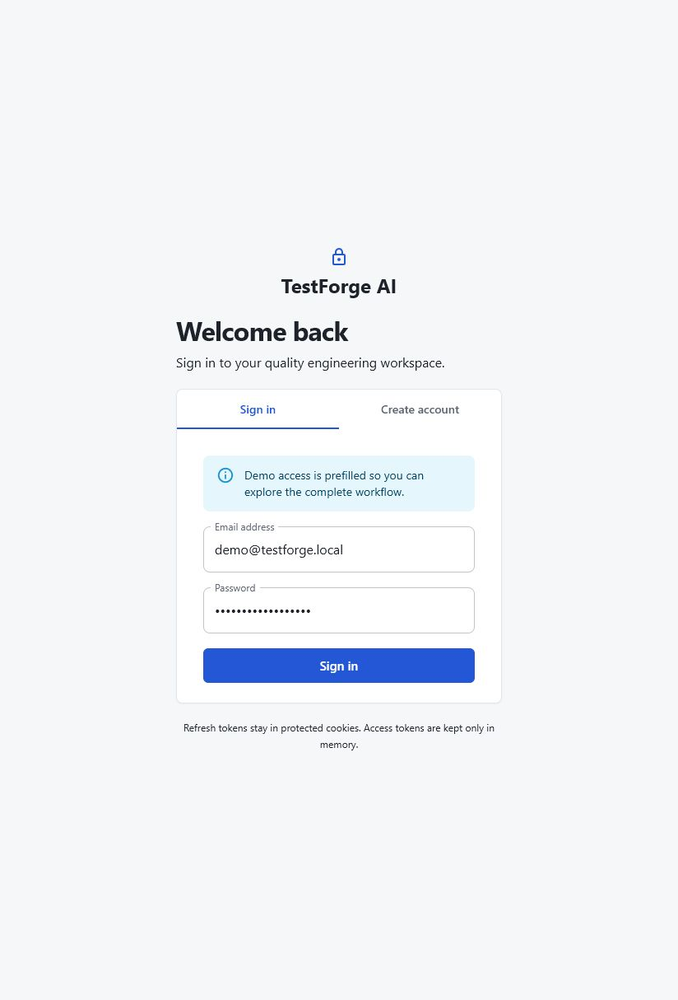
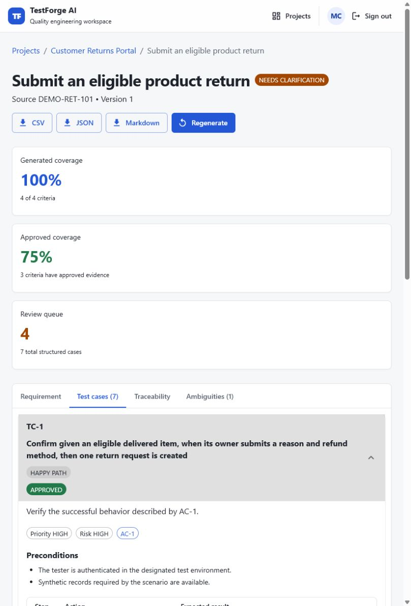
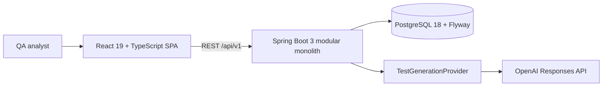

# TestForge AI

TestForge AI is a production-oriented Stage 1 MVP for turning requirements and acceptance criteria into structured, reviewable manual test cases. It is a quality-engineering workflow rather than a chat interface: generated output is schema-validated, mapped to acceptance criteria, edited and reviewed by a human, versioned, audited, and exportable only after approval.

## Problem being solved

Teams often turn the same requirement into disconnected documents, generic AI prose, and test evidence with no durable link back to acceptance criteria. TestForge AI keeps the source, ambiguity analysis, structured cases, human decisions, revisions, and exports in one owner-isolated system while treating the model as an untrusted drafting dependency.

## Screenshots

| Secure entry | Requirement review and traceability |
| --- | --- |
|  |  |

## MVP capabilities

- Register, sign in, refresh, sign out, and recover a browser session with short-lived JWT access tokens and rotating HttpOnly refresh cookies.
- Create owner-isolated projects and requirements with measurable acceptance criteria.
- Track user stories and test cases with immutable, globally unique ADO-style work-item numbers while keeping UUIDs as internal routing identifiers.
- Generate requirement-specific happy-path, boundary, validation, security, recovery, concurrency, and accessibility coverage through a provider-neutral boundary.
- Generate runtime test cases only through the OpenAI Responses API with strict Structured Outputs; deterministic output exists only as a test fixture and is never packaged into the application.
- Detect and resolve requirement ambiguity without silently inventing business rules.
- Edit structured preconditions, synthetic test data, steps, expected results, priority, risk, and automation candidacy.
- Review cases in natural test-case-number order by default, with text search, status/category/priority filters, and alternate sort modes.
- Approve, reject, or request changes with immutable review and revision history.
- Inspect acceptance-criterion coverage and traceability.
- Export approved cases to CSV, JSON, or Markdown with formula- and markup-injection defenses.
- Review security-relevant actions through the audit API.

## Architecture



The API is one deployable with explicit domain packages for `auth`, `project`, `requirement`, `generation`, `testcase`, `traceability`, `export`, and `audit`. Controllers never return persistence entities. Ownership checks live in server-side services and repository queries. See [architecture](docs/ARCHITECTURE.md), [API guide](docs/API.md), [threat model](docs/THREAT_MODEL.md), and [ADRs](docs/decisions).

## Technology

- Java 21, Spring Boot 3.5, Spring Security, OAuth2 resource server, Spring Data JPA, Hibernate, Flyway, PostgreSQL, H2 demo profile, Actuator, and OpenAPI.
- React 19, TypeScript 6, Vite 8, Material UI 9, React Router 7, TanStack Query, React Hook Form, and Zod.
- JUnit 5, MockMvc, AssertJ, Vitest, React Testing Library, MSW, Playwright, and axe-core.
- Spotless, SpotBugs, JaCoCo, OWASP Dependency-Check, ESLint, Prettier, npm audit policy, Docker, Nginx, and GitHub Actions.

## Fastest demo

Prerequisites: Java 21, Maven 3.9+, Node.js 24, npm 11, and an OpenAI API key.

Start the seeded backend:

```powershell
Set-Location backend
$env:OPENAI_API_KEY = '<server-side-secret>'
mvn spring-boot:run -Dspring-boot.run.profiles=demo
```

Start the frontend in a second terminal:

```powershell
Set-Location frontend
npm ci
npm run dev
```

Open `http://127.0.0.1:5173` and use the prefilled account:

- Email: `demo@testforge.local`
- Password: `TestForge!Demo2026`

The demo contains a Commerce Returns Platform project with four professionally specified user stories covering customer workflows, authorization, boundary conditions, idempotency, concurrency, failure atomicity, auditability, and accessibility. It intentionally seeds no test cases or steps: every test artifact must be generated from a story through the configured provider. The demo profile uses a local H2 file and fixed non-production credentials; never enable it in a shared or production environment.

## Docker Compose

Docker provides a production-like PostgreSQL topology:

```powershell
Copy-Item .env.example .env
# Replace POSTGRES_PASSWORD, JWT_ACCESS_TOKEN_SECRET, and OPENAI_API_KEY in .env.
docker compose up --build --wait
```

Open:

- Application: `http://localhost:3000`
- API readiness: `http://localhost:8080/actuator/health/readiness`
- Swagger UI when enabled: `http://localhost:8080/swagger-ui.html`

The default Compose environment does not seed a shared demo account. Register through the UI, or set `TESTFORGE_DEMO_SEED_ENABLED=true` only for an isolated disposable environment. Stop with `docker compose down`; add `--volumes` only when you intentionally want to delete local database data.

## AI generation provider

Runtime generation uses the OpenAI adapter. The local deterministic provider is compiled only into backend tests, which prevents deployed environments from returning canned test cases or step sequences. Configure the server with:

```text
TEST_GENERATION_PROVIDER=openai
OPENAI_API_KEY=<server-side-secret>
OPENAI_MODEL=gpt-5.6-sol
```

The adapter uses `POST /v1/responses`, `store: false`, a versioned prompt, strict JSON Schema, bounded connect/read/output limits, minimized requirement data, and no browser-exposed credential. Provider output still passes application-owned semantic validation; one controlled regeneration is allowed before invalid output is rejected. Review your organization's data policy before sending requirement content to any external provider.

The model does not assign identity. A single database sequence assigns every user story and test case an immutable numeric work-item ID, and test-case labels such as `TC-1042` are derived from that ID rather than supplied by the model or reset for each story.

## Configuration

| Variable | Required | Default | Purpose |
| --- | --- | --- | --- |
| `POSTGRES_DB` | Compose | `testforge` | Database name |
| `POSTGRES_USER` | Compose | `testforge_app` | Application database role |
| `POSTGRES_PASSWORD` | Yes outside demo | none | Database secret |
| `JWT_ACCESS_TOKEN_SECRET` | Yes outside demo | none | Base64-encoded key containing at least 32 bytes |
| `ALLOWED_ORIGINS` | No | `http://localhost:5173` | Exact credentialed CORS origins |
| `SECURE_COOKIES` | No | `true` | Requires HTTPS for refresh cookies |
| `TEST_GENERATION_PROVIDER` | No | `openai` | Runtime generation provider; `fake` is test-scope only |
| `OPENAI_API_KEY` | Yes for generation | none | Server-side provider key |
| `OPENAI_MODEL` | No | `gpt-5.6-sol` | Provider model, overridable for controlled evaluations |
| `OPENAPI_ENABLED` | No | `false` | Exposes API docs when explicitly enabled |
| `TESTFORGE_DEMO_SEED_ENABLED` | No | `false` | Seeds the non-production sample workspace |

Additional token lifetimes, rate limits, model timeouts, output limits, ports, and cookie names are documented in [.env.example](.env.example) and `backend/src/main/resources/application.yml`.

## Verification

Backend:

```powershell
Set-Location backend
mvn verify
mvn -Psecurity org.owasp:dependency-check-maven:check
```

`mvn verify` enforces Java/Maven versions, tests, formatting, SpotBugs, and minimum 80% line / 70% branch coverage. The verified MVP currently exceeds both thresholds.

Frontend:

```powershell
Set-Location frontend
npm ci
npm run format:check
npm run typecheck
npm run lint
npm run test:coverage
npm run build
npm run audit:ci
npm run e2e
```

The Playwright scenario signs into the seeded workspace, traverses project, requirement, test-case, and traceability views, verifies keyboard focus, and rejects serious or critical axe violations.

## Security posture

- Argon2id password hashing; JWT issuer, audience, timestamp, and HMAC validation.
- Access tokens stay in memory; refresh tokens are random, hashed at rest, rotated, family-revoked on reuse, and delivered only as HttpOnly SameSite cookies.
- CSRF double-submit cookie protection, exact credentialed CORS, rate limits, security headers, UUID-normalized correlation IDs, strict request DTOs, size limits, and generic errors.
- Owner-scoped object access returns `404` across tenant boundaries.
- Requirements and provider responses are untrusted. Prompts resist instruction injection; output is structurally and semantically validated before persistence.
- Approved-only exports neutralize spreadsheet formulas and Markdown control characters.
- Secrets and sensitive request bodies are excluded from audit records and application logs.

See [SECURITY.md](SECURITY.md) and [the STRIDE threat model](docs/THREAT_MODEL.md). A narrow, expiring React Router RSC advisory exception is documented in [the dependency risk register](docs/DEPENDENCY_RISK_ACCEPTANCE.md); the affected RSC feature is not present in this SPA.

## Known limitations

- The included rate limiter is process-local; multi-instance production requires a gateway or distributed store.
- The MVP has user-level ownership but no organization sharing, enterprise SSO, MFA, email verification, password reset, or administrative UI.
- Generation runs synchronously within a bounded request. A public, high-volume deployment should use a durable queue and worker.
- Generation quality depends on the configured model and must be evaluated with representative, organization-specific requirements before production rollout.
- Docker Compose is suitable for local evaluation, not a complete cloud landing zone. Public deployment still needs managed secrets, TLS, backups, monitoring, SIEM integration, and artifact signing.

## Stage 2 Copado roadmap

This release delivers Stage 1 manual-test design. It intentionally does not generate or execute Copado Robotic Testing automation. A later `AutomationDraftGenerator` boundary can translate approved cases only after organization-specific selectors, reusable actions, environments, test data, and review rules are available.

The future slice can add suitability scoring, action mapping, selector placeholders, parameterized data, assertions, setup and cleanup actions, draft export, imported execution results, and failure classification. Every generated draft must remain reviewable; TestForge does not assume a manual case can become reliable automation without that organization-specific context.
