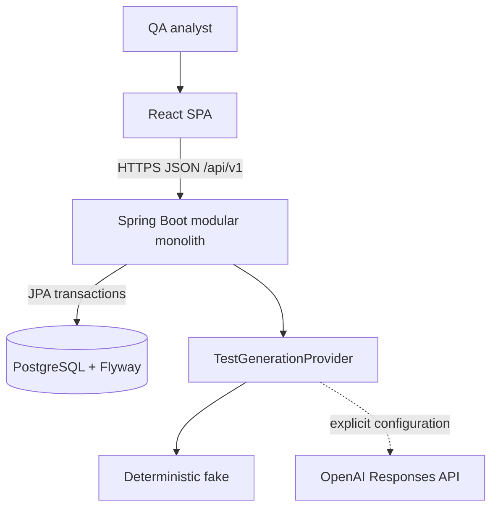
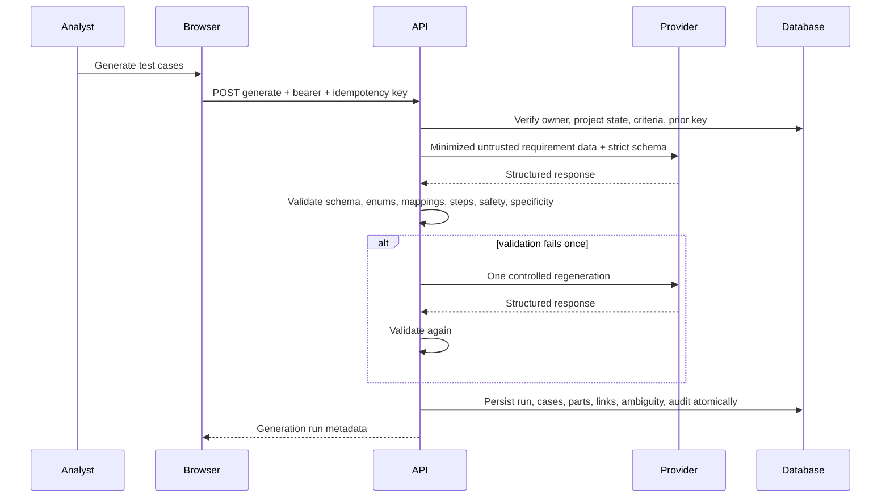

# Architecture

## System context

TestForge AI helps a QA analyst turn bounded product requirements into human-reviewed manual test evidence. The browser handles presentation and transient access-token state. The Spring Boot API is the security, workflow, validation, and persistence authority. PostgreSQL owns durable records. Generation providers never receive database or browser authority.

## Deployment containers

The frontend image builds immutable static assets and serves them from unprivileged Nginx. Nginx proxies `/api` to the backend. The backend image runs an unprivileged Java 21 process. PostgreSQL uses SCRAM host authentication and a persistent volume. Container `no-new-privileges` is enabled. Production deployments must add TLS, a secret store, private networking, backups, monitoring, and an ingress-level shared rate limiter.

## Backend modules

| Module | Responsibility |
| --- | --- |
| `auth`, `user`, `security` | Identity, JWTs, refresh rotation, CSRF/CORS, current actor, limits |
| `project` | Owner-isolated workspaces and lifecycle |
| `requirement` | Source story, criteria, ambiguity, optimistic versions, revisions |
| `generation` | Provider contract, prompt/schema, validation, run metadata, persistence coordination |
| `testcase` | Structured cases, parts, edits, revisions, and human review |
| `traceability` | Criterion-to-case evidence and approved/raw coverage |
| `export` | Approved-only CSV, JSON, and Markdown representations |
| `audit` | Correlated non-sensitive action evidence |
| `common`, `config` | Errors, correlation, paging, runtime configuration |

Controllers accept dedicated DTOs, application services own transactions, repositories apply scoped queries, and entities never cross the HTTP boundary. The modules live in one deployable to preserve simple local operation and consistent transactions while keeping later extraction paths visible.

## Core generation sequence

Provider failure and invalid output become safe generation-run states; raw provider error bodies are not returned. Model name, provider, prompt version, input hash, tokens, latency, correlation ID, and outcome are retained for reproducibility and operations.

## Data model

The normalized schema includes users, refresh-token families, projects, requirements, acceptance criteria, requirement ambiguities and revisions, generation runs, test cases, preconditions, steps, test data, traceability links, reviews, test-case revisions, and audit events. UUIDs avoid guessable sequential identifiers, but ownership validation remains mandatory. Optimistic versions prevent lost updates. Flyway is the only schema migration mechanism; Hibernate validates rather than creates production tables.

## Authentication and browser state

The API issues a short-lived JWT access token to browser memory and a long-lived opaque refresh token in an HttpOnly SameSite cookie. Refresh rotates the token and invalidates its predecessor. Reuse revokes the token family. On reload, the SPA bootstraps CSRF state and attempts refresh; it never writes tokens to local or session storage.

Cookie-authenticated mutations require a double-submit CSRF token. Bearer requests are still constrained by exact credentialed CORS in browsers. JWTs validate signature, timestamp, issuer, and `testforge-api` audience.

## Error and observability contract

Errors use RFC 7807 with stable `code`, status, safe detail, instance path, timestamp, correlation ID, and optional field violations. A valid incoming `X-Correlation-ID` must be a UUID and is normalized; invalid input is replaced. Audit metadata is intentionally small and non-sensitive. Actuator exposes health, liveness, readiness, and static application info without internal details.

## Quality boundaries

Backend verification enforces formatting, SpotBugs, and 80% line / 70% branch coverage. Frontend verification enforces Prettier, TypeScript, ESLint, unit coverage, a production bundle, and an executable high/critical advisory policy. Playwright traverses the seeded analyst workflow and axe checks each major page. CI also builds the Compose topology and waits for health checks.

## Decisions

- [ADR 0001: Modular monolith](decisions/0001-modular-monolith.md)
- [ADR 0002: Browser authentication](decisions/0002-browser-authentication.md)
- [ADR 0003: Provider-neutral validated generation](decisions/0003-provider-neutral-generation.md)
- [ADR 0004: Human approval and approved-only export](decisions/0004-human-approval.md)
- [ADR 0005: Java and Spring backend](decisions/0005-java-spring-backend.md)
- [ADR 0006: React and TypeScript frontend](decisions/0006-react-typescript-frontend.md)
- [ADR 0007: Structured AI output](decisions/0007-structured-ai-output.md)
- [ADR 0008: PostgreSQL and Flyway](decisions/0008-postgresql-flyway.md)
