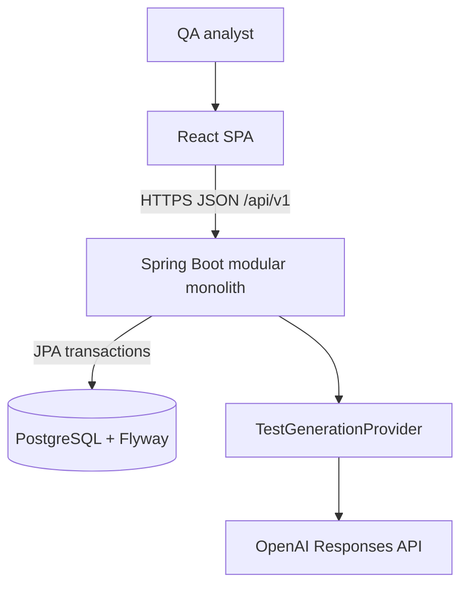

# Architecture

## System context

TestForge AI helps a QA analyst turn bounded product requirements into human-reviewed manual test evidence. The browser handles presentation and transient access-token state. The Spring Boot API is the security, workflow, validation, and persistence authority. PostgreSQL owns durable records. Generation providers never receive database or browser authority.



## Deployment containers

The frontend image builds immutable static assets and serves them from unprivileged Nginx. Nginx proxies `/api` to the backend. The backend image runs an unprivileged Java 21 process. PostgreSQL uses SCRAM host authentication and a persistent volume. Container `no-new-privileges` is enabled. Production deployments must add TLS, a secret store, private networking, backups, monitoring, and an ingress-level shared rate limiter.

## Backend modules

| Module | Responsibility |
| --- | --- |
| `auth`, `user`, `security` | Identity, JWTs, refresh rotation, CSRF/CORS, current actor, limits |
| `workspace` | Personal tenancy, memberships, and caller-scoped workspace listing |
| `project` | Owner-isolated projects and lifecycle; additive workspace assignment |
| `requirement` | Source story, criteria, ambiguity, optimistic versions, revisions |
| `generation` | Provider contract, prompt/schema, validation, run metadata, persistence coordination |
| `testcase` | Structured cases, parts, edits, revisions, and human review |
| `traceability` | Criterion-to-case evidence and approved/raw coverage |
| `export` | Approved-only CSV, JSON, and Markdown representations |
| `audit` | Correlated non-sensitive action evidence |
| `common`, `config` | Errors, correlation, paging, runtime configuration |

Controllers accept dedicated DTOs, application services own transactions, repositories apply scoped queries, and entities never cross the HTTP boundary. The modules live in one deployable to preserve simple local operation and consistent transactions while keeping later extraction paths visible.

## Core generation sequence

```mermaid
sequenceDiagram
    participant U as Analyst
    participant B as Browser
    participant A as API
    participant P as Provider
    participant D as Database
    U->>B: Generate test cases
    B->>A: POST generate + bearer + idempotency key
    A->>D: Lock story; claim key and persist PENDING run + exact snapshots
    D-->>A: Commit provider-independent claim
    A->>P: Minimized untrusted requirement data + strict schema
    P-->>A: Structured response
    A->>A: Validate schema, enums, mappings, steps, safety, specificity
    alt validation fails once
        A->>P: One controlled regeneration
        P-->>A: Structured response
        A->>A: Validate again
    end
    A->>D: Lock PENDING run; persist cases, dual links, ambiguity, audit atomically
    A-->>B: Generation run metadata
```

No database transaction spans the provider call. Provider failure and invalid
output become safe generation-run states; raw provider error bodies are not
returned. New runs retain model/provider plus the
`manual-test-v2`/`manual-test-result-v1`/`manual-test-schema-v2`/
`manual-test-validator-v2`/`openai-responses-v3` release evidence, source User
Story version and provenance, input hash, tokens, latency, correlation ID, and
outcome. The prompt performs internal atomic-coverage decomposition only; no
coverage-item inventory, schema, persistence, API, or frontend contract is
created. It permits a direct case to map multiple supplied criteria when one
workflow independently verifies them, while avoiding redundant splits.
Incomplete, empty, malformed, or semantic output retries once;
refusal, configuration, authentication, and transport failures do not. The
provider adapter rejects an unsupported strict-schema keyword before making a
request. Its exact three-field wire reader rejects provider-authored transport
metadata, unknown fields, scalar coercion, fractional integers, numeric enums,
and null primitive values, while presence-aware semantic validation enforces
the remaining persistence bounds, enum parity, and executable-content policy
across every provider-authored field. Critical ambiguity severity remains
available because it is already part of the canonical domain and signals a
generation-blocking clarification need.

## Data model

The normalized schema includes users, refresh-token families, projects, requirements, acceptance criteria, requirement ambiguities and revisions, generation runs, immutable generation criterion snapshots, test cases, preconditions, steps, test data, legacy and snapshot traceability links, reviews, test-case revisions, and audit events. The existing `requirements` table is the physical store for the canonical User Story aggregate. V6 is an additive expand/backfill/dual-write migration: it preserves old columns and nullable rollback paths, labels reconstructed pre-V6 evidence `LEGACY_RECONSTRUCTED`, and never claims exact history that was not retained. UUIDs remain the non-guessable internal identifiers used for routes and authorization. A separate shared database sequence issues immutable ADO-style work-item numbers for user stories and test cases; those display numbers never replace owner validation. Aggregate optimistic versions protect both story fields and criterion mutations. Flyway is the only schema migration mechanism; Hibernate validates rather than creates production tables.

Completed generation runs are immutable generation sets. One application
resolver orders successful runs by completion time then UUID, designates the
latest active, and assigns stable one-based set numbers. Cases, traceability,
coverage, review, and export use that resolver; explicit historical selection
is read-only. Coverage and export read immutable snapshots; primary metrics are
DIRECT-only and report partial/supporting evidence separately. Test-data name/reference integrity is likewise centralized in one
policy used before generation persistence and case edits. Review and reopen
transitions live in the test-case entity, while revisions, reviews, and audit
events remain separate append-only evidence views. During the V6 compatibility
window, bounded locked reconcilers detect old-binary writes that omit new
generation or reopen evidence. They reconstruct only knowable state with
explicit legacy provenance, transfer a legacy reopen reason into a controlled
revision, and scrub that reason from closed audit metadata only after the
source-linked revision exists. An orphan row whose test case is unavailable
remains unreconciled for operator repair. A direct export
invokes generation-evidence reconciliation before its snapshot-only read, then
batch-assembles at most 100 approved cases without per-case repository calls.
An existing-key generation POST uses the same reconciler before returning a
bridge-written run. Finalization carries the source criterion UUID captured at
claim time: a key rename dual-writes the legacy link to that same owned row,
while deletion produces `FAILED/source_criteria_changed` before any generated
case or link is written. Immutable snapshots remain truthful in both outcomes.

## Authentication and browser state

The API issues a short-lived JWT access token to browser memory and a long-lived opaque refresh token in an HttpOnly SameSite cookie. Refresh rotation locks the predecessor and commits either one successor or replay-family revocation before returning the same generic authentication failure and expired cookie for every rejected refresh. On reload, the SPA bootstraps CSRF state and attempts refresh; it never writes tokens to local or session storage. A monotonic client epoch invalidates older refresh and CSRF completions, and one reset clears all session-scoped token/promise caches on refresh failure, logout completion, and before a new login or registration. Client address buckets accept one sanitized IP literal forwarded only from configured trusted socket-peer CIDRs; the parser performs no DNS lookup and Nginx overwrites caller forwarding input.

Cookie-authenticated mutations require a double-submit CSRF token. Bearer requests are still constrained by exact credentialed CORS in browsers. JWTs validate signature, timestamp, issuer, and `testforge-api` audience.

## Error and observability contract

Errors use RFC 7807 with stable `code`, status, safe detail, instance path, timestamp, correlation ID, and optional field violations. A valid incoming `X-Correlation-ID` must be a UUID and is normalized; invalid input is replaced. Audit metadata is intentionally small and non-sensitive. Actuator exposes health, liveness, readiness, and static application info without internal details.

## Quality boundaries

Backend verification enforces formatting, SpotBugs, and 80% line / 70% branch coverage. H2 and the deterministic generation provider are test-scoped and excluded from the packaged application. Frontend verification enforces Prettier, TypeScript, ESLint, unit coverage, a production bundle, pure fail-closed audit-policy tests, and an executable high/critical advisory policy with no allowlist. Default Playwright uses a synthetic external Responses stub to traverse generation, review, traceability, export, terminal failure, and axe checks without a paid provider. A separately invoked live-generation suite remains optional. Default Compose publishes only Nginx; backend and PostgreSQL remain on private networks.

## Decisions

- [ADR 0001: Modular monolith](decisions/0001-modular-monolith.md)
- [ADR 0002: Browser authentication](decisions/0002-browser-authentication.md)
- [ADR 0003: Provider-neutral validated generation](decisions/0003-provider-neutral-generation.md)
- [ADR 0004: Human approval and approved-only export](decisions/0004-human-approval.md)
- [ADR 0005: Java and Spring backend](decisions/0005-java-spring-backend.md)
- [ADR 0006: React and TypeScript frontend](decisions/0006-react-typescript-frontend.md)
- [ADR 0007: Structured AI output](decisions/0007-structured-ai-output.md)
- [ADR 0008: PostgreSQL and Flyway](decisions/0008-postgresql-flyway.md)
- [ADR 0011: Runtime PostgreSQL and test database boundary](decisions/0011-runtime-postgresql-and-test-database-boundary.md)
## Workspace-tenancy evolution

TF-001 adds a `workspace` module to the modular monolith. Registration creates
a deterministic personal workspace and OWNER membership in the same transaction
as the user/session. Flyway V4 adds nullable `projects.workspace_id`, backfills
it from `owner_id`, and new project creation dual-writes both fields. The column
stays nullable for old-binary rollback compatibility.

This release does not replace owner authorization. Membership scopes only
`GET /api/v1/workspaces`; every project-derived resource continues to use its
existing owner predicate and cross-owner `404` response. Shared-content policy
and any contract removal of `owner_id` require separate releases.

Detailed target references: [target architecture](architecture/target-architecture.md),
[domain model and snapshots](architecture/domain-model.md), [AI pipeline](architecture/ai-generation-pipeline.md),
[automation/Copado design](architecture/copado-generation-architecture.md), and
[security model](architecture/security-model.md).
