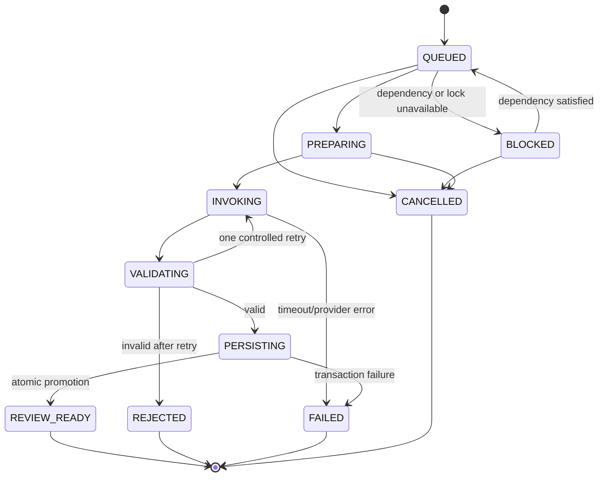

# AI generation pipeline

## Safety model

The model is an untrusted drafting dependency. The application owns identity,
authorization, work-item numbers, lifecycle transitions, validation, review,
and persistence. Requirement content is untrusted data, never instructions.

## Implemented synchronous pipeline

1. Lock and authorize the User Story through the existing owner predicate.
2. Validate request bounds and hash the idempotency key.
3. In one short claim transaction, return an existing key or persist one
   `PENDING` run, immutable exact criterion snapshots, source User Story
   version, captured source criterion UUIDs, and the complete release tuple.
   Existing bridge-shaped runs are reconciled before the POST response.
4. Commit the claim before provider work. A stale `PENDING` claim becomes a safe
   terminal failure rather than invoking the same key again.
5. Invoke the configured provider outside a database transaction through
   `TestGenerationProvider`. Runtime uses the Responses API; deterministic fake
   output is test-scope only.
6. Parse only the three schema-owned root fields with exact JSON scalar and enum
   types, then apply application-owned semantic checks: enum/size/order
   constraints, criterion mapping, uniqueness, meaningful expected results,
   safe synthetic data, and prohibited executable content. Provider-authored
   usage metadata, scalar coercion, and fractional integers are rejected.
7. Retry exactly once for incomplete, empty, malformed, or semantically invalid
   structured output. Do not retry refusal, configuration/authentication, or
   transport failure.
8. Lock/reload `PENDING` state and atomically persist cases, parts, ambiguity,
   legacy and snapshot traceability, requirement state, audit evidence, and the
   terminal run. A renamed criterion dual-writes by its captured owned UUID; a
   deleted criterion produces `FAILED/source_criteria_changed` before any case
   graph write. Late responses cannot change terminal evidence.
9. Read traceability/coverage/export from immutable snapshots, require direct
   evidence for every source criterion, and require human review before
   approved-only export.

The implemented Stage 1 tuple is provider/model plus `manual-test-v2`,
`manual-test-result-v1`, `manual-test-schema-v2`,
`manual-test-validator-v2`, and `openai-responses-v3`. Pre-V6 source evidence is
reconstructed only from then-current criteria and labeled
`LEGACY_RECONSTRUCTED`; exact lost history is never inferred. The v2 prompt
internally decomposes supplied acceptance criteria into atomic testable
obligations and asks for the smallest coherent nonredundant suite, allowing one
direct case to map multiple criteria only when a realistic workflow proves them
independently. It emits neither the decomposition nor a coverage inventory and
does not alter the result/schema/validator/provider/persistence/API/frontend
contracts. This includes
bounded runtime reconciliation of V5-shaped rows created by an old binary after
V6 is already installed. The bridge locks each affected run, fills only missing
release/snapshot/link evidence, and is idempotent.

## Target durable pipeline

The target is a composition of narrow application services. They may share one
provider adapter, but they do not share an unversioned “do everything” prompt.

| Stage service | Versioned prompt/schema | Input snapshot | Output and application-owned validation |
| --- | --- | --- | --- |
| `RequirementAnalysisService` | Analysis prompt/schema | Requirement, criteria, safe extracted source resources | Structured actors, rules, assumptions, ambiguity, risks, boundaries, dependencies, questions; validator forbids invented resolutions and requires source references |
| `CoveragePlanningService` | Coverage-plan prompt/schema | Accepted analysis and requirement snapshot | CoveragePlan/Items with criterion joins, risks, negative/boundary/accessibility/security obligations; validator detects missing/duplicate criteria, unsupported exclusions, and vague evidence |
| `ManualTestGenerationService` | Manual-test prompt/schema | Approved coverage-plan snapshot | Suite/cases/steps/data mapped to coverage items; validator enforces ordering, observable results, safe data, traceability, limits, and no executable content |
| `GenerationValidationService` | No generative prompt | Candidate plus all pinned source snapshots | Deterministic schema, semantic, cross-stage, policy, provenance, hash, bound, and duplication decisions; only this service permits persistence promotion |
| `AutomationAssessmentService` | Readiness prompt/schema | Approved manual suite/case snapshots plus approved application-map metadata | Suitability score, blockers, unsupported steps, context requirements; validator cannot turn missing selectors or credentials into READY |
| `AutomationPlanService` | Neutral-draft prompt/schema | Approved readiness decision and exact manual snapshots | Declarative neutral IR only; validator allowlists actions, bounds retry/loops, verifies assertions/cleanup/secret references, and rejects code |

Each stage has its own provider/model/prompt/result-contract/schema/validator
release tuple and sanitized fixture set. A downstream prompt receives only
accepted immutable upstream snapshots. Changing one stage cannot silently
reinterpret already approved upstream evidence.

Each transition must be compare-and-set, timestamped, observable, and safe to
retry. The job stores prompt/schema/model versions and hashes, not hidden model
reasoning. Cancellation prevents future work but never erases run evidence.

The durable job identity is `(workspace_id, stage, source_snapshot_id,
idempotency_key_hash)`. Submission returns the existing job for a matching key
and source; reusing a key with different input is a conflict. A worker claims a
lease with a fencing token, renews it while invoking, and can safely resume only
from a persisted transition. Candidate output is quarantined until validation
and one database transaction promotes the complete stage artifact and links.

Retries are classified: bounded exponential transport retries may reuse the
same candidate attempt; one semantic-regeneration attempt receives validator
feedback stripped of secrets; policy/authorization/schema-version failures are
not retried. Every terminal failure records a safe code, attempt count, release
tuple, latency, and correlation ID without storing hidden reasoning or sensitive
source bodies.

## Cross-stage validators

- Analysis must cite supplied source/criterion IDs, distinguish fact from
  assumption, and surface unresolved policy rather than invent it.
- Coverage must account for every in-scope criterion, carry explicit reviewed
  exclusions, avoid duplicate obligations, and include risk-appropriate
  negative, boundary, permission, recovery, accessibility, and integration paths.
- Manual cases must realize approved coverage items, keep steps contiguous and
  independently observable, use synthetic bounded data, and preserve final
  outcomes and stable traceability.
- Automation readiness cannot be READY when manual steps, selectors, reusable
  actions, environment constraints, cleanup, or secret references are missing.
- Neutral automation plans cannot contain Python, JavaScript, shell, raw SQL,
  opaque binaries, unknown libraries, active credentials, destructive
  unbounded actions, or semantics not present in the approved snapshots.

## Release and evaluation contract

A generation release is the tuple of provider adapter, model identifier,
prompt version, result-contract version, output-schema version, and
semantic-validator version. Any change to that tuple runs sanitized fixtures
against the versioned rubric, compares a pinned baseline, blocks on hard
failures, and records the result.
Live evaluations require explicit authorization and must not contain customer
requirements or credentials. No generation contract changes are part of TF-001.

Default unit, integration, migration, browser, harness, and CI runs use mocks or
sanitized deterministic fixtures and make no live provider calls. Live
evaluation is a separately named, explicitly authorized workflow with budget,
data classification, release tuple, retained score report, and no production
mutation. A live result never becomes a test fixture automatically.

## Failure behavior

- Authorization and invalid input fail before provider invocation.
- Timeouts, transport errors, malformed output, excessive output, or semantic
  rejection return bounded generic errors and do not persist partial cases.
- Idempotent replay returns the existing run rather than purchasing duplicate
  work.
- Provider degradation must support an operator disable switch and must not
  bypass validation or approval.
