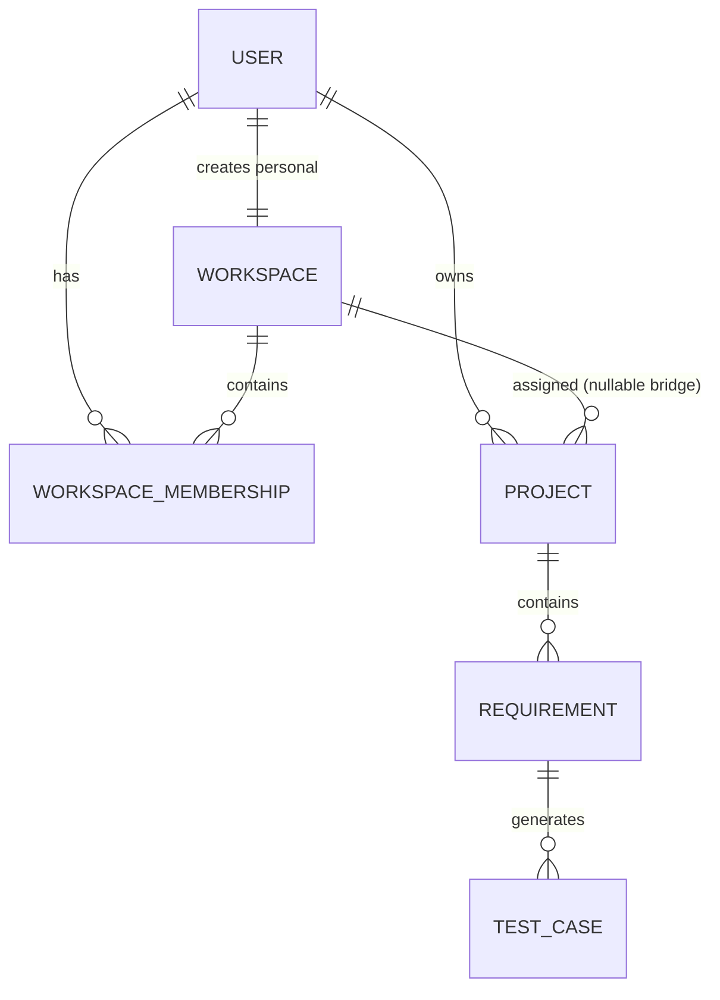
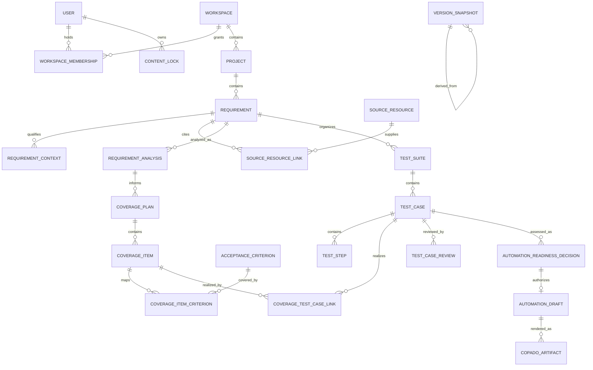

# Target domain model

## Implemented foundation

`owner_id` remains the authorization source in TF-001. `workspace_id` is an
additive association and may be null for mixed-version writes. A personal
workspace and its OWNER membership reuse the user UUID so legacy backfill is
deterministic. Roles are OWNER, ADMIN, QA_AUTHOR, QA_REVIEWER, and STAKEHOLDER;
their shared-content permissions are future policy, not implicit behavior.

## Target aggregate and relationship map

Everything below this heading is future unless explicitly identified as an
existing Stage 1 record. The ordering is intentional: source and analysis
precede coverage, coverage precedes manual cases, and approved manual snapshots
precede automation.

## Entity definitions

| Entity | Identity and ownership | Responsibility and key relationships |
| --- | --- | --- |
| User | Stable UUID; account lifecycle independent of workspace role | Authenticates a human and acts on memberships, reviews, locks, snapshots, and audit events |
| Workspace | Stable UUID; personal workspace UUID equals user UUID in TF-001 | Tenant boundary, policy/retention configuration, projects, members, resources |
| WorkspaceMembership | Stable UUID; deterministic personal membership UUID equals user UUID | Joins user/workspace with active/archive status and OWNER/ADMIN/QA_AUTHOR/QA_REVIEWER/STAKEHOLDER role |
| Project | Stable UUID plus current owner compatibility field | Workspace container for requirements, source resources, suites, and audit scope |
| Requirement | Stable UUID plus immutable stable display key (the current global work-item number is retained through migration) and Project ID | Target fields are title, description, requirement type, application name, persona, exact status, created/updated by, created/updated timestamps; owns ordered contexts and criteria and points to immutable snapshots/source links |
| RequirementContext | Stable UUID, Requirement ID, typed context, unique display order within `(requirement, type)` | Ordered target types are exactly Preconditions, Test data, Business rules, Environment, Dependencies, Permissions, Out of scope, and Additional notes; each row carries bounded text and timestamps and is versioned with the requirement |
| RequirementAnalysis | Stable UUID and monotonically increasing analysis revision | Exact target data is Requirement ID plus analyzed requirement-version ID, blocking issues, warnings, minor assumptions, automation-context gaps, analysis status, and generation-run reference; findings cite contexts/criteria/source snapshots and never mutate the analyzed version |
| AcceptanceCriterion | Stable UUID, Requirement ID, immutable stable display key | Exact target fields are text, structured format type, display order, status, and timestamps; display key/order are unique in the requirement lineage, and criterion snapshots join coverage items |
| CoveragePlan | Stable UUID and revision for a requirement-analysis snapshot | Reviewable strategy with scope, risk basis, generation release, status, and coverage items |
| CoverageItem | Stable UUID within a plan | One test obligation/path with category, priority/risk, rationale, negative/boundary dimensions, expected evidence, automation signal, and zero-or-more criterion joins; zero criteria is permitted only for labeled exploratory support |
| CoverageItemCriterion | Composite/join UUID with uniqueness on item/criterion | Many-to-many mapping preserving coverage intent and criterion snapshot identity |
| TestSuite | Stable UUID and optional immutable suite number/name | Orders and groups manual cases for a requirement/project, with lifecycle and current snapshot |
| TestCase | Stable UUID and immutable global work-item number | Manual test head derived from one or more coverage items; owns preconditions, data, ordered steps, reviews, and revisions |
| TestStep | Stable UUID plus unique contiguous sort order per case snapshot | One observable action and independently observable expected result; no executable payload |
| CoverageTestCaseLink / criterion traceability | Stable join identity and uniqueness | Links case snapshot to coverage item and criterion snapshot with DIRECT or supporting intent; replaces inference from mutable current rows |
| TestCaseReview | Stable UUID bound to exact case snapshot | APPROVE, REJECT, or REQUEST_CHANGES decision, actor, comment, time, and policy evidence; later edits invalidate approval |
| ContentLock | Stable UUID, target type/ID, owner, fencing token, acquired/expiry time | Coordinates long edit/generation/restore operations; never grants authorization and cannot override optimistic versions |
| VersionSnapshot | Stable UUID, logical artifact ID/type, revision, canonical hash | Immutable payload and ancestry for requirements, analyses, plans, suites, cases, drafts, approvals, and exports |
| SourceResource | Stable UUID, workspace/project scope, SHA-256 digest, media type, size, origin, parser status | Catalogs pasted/uploaded source with immutable provenance; extracted safe text is a derived snapshot, never an executable import |
| SourceResourceLink | Stable join identity | Records which exact source resource/revision informed a requirement, analysis, plan, or generation run |
| AutomationReadinessDecision | Stable UUID bound to approved case/suite snapshots | Human-reviewed suitability, blockers, unsupported steps, target constraints, and READY/NOT_READY/NEEDS_CONTEXT decision |
| AutomationDraft | Stable UUID and revision | Platform-neutral setup/action/assertion/cleanup IR derived only after readiness approval |
| CopadoArtifact | Stable UUID and adapter/schema version | Non-executing rendered representation of an approved neutral draft, with digest and validation report; import/execution remains external |

## Exact target lifecycles

These are the architecture-reset directive's literal state sets. They are
target contracts and are not implemented by TF-001.

- Requirement: `DRAFT`, `NEEDS_INFORMATION`, `READY`, `APPROVED`, `ARCHIVED`.
- CoveragePlan: `DRAFT`, `REVIEWED`, `APPROVED`, `CHANGES_REQUESTED`.
- TestSuite: `DRAFT`, `REVIEWED`, `APPROVED`, `CHANGES_REQUESTED`, `REJECTED`,
  `ARCHIVED`.
- TestCase: `DRAFT`, `REVIEWED`, `APPROVED`, `CHANGES_REQUESTED`, `REJECTED`,
  `ARCHIVED`. A case may be approved independently; the suite UI and API must
  expose partial approval rather than deriving suite approval from one case.
- AutomationArtifact: `DRAFT`, `VALIDATION_FAILED`, `VALIDATED`, `REVIEWED`,
  `APPROVED`, `CHANGES_REQUESTED`, `ARCHIVED`.

Allowed target transitions are explicit commands, not arbitrary status writes:
Requirement moves from DRAFT to NEEDS_INFORMATION or READY, then APPROVED, and
may archive from a non-archived state. CoveragePlan moves DRAFT to REVIEWED,
then APPROVED or CHANGES_REQUESTED; changes create/revise DRAFT content before a
new review. TestSuite/TestCase move DRAFT to REVIEWED, then APPROVED,
CHANGES_REQUESTED, or REJECTED; changes return to DRAFT for another review, and
archive is explicit. AutomationArtifact moves DRAFT to VALIDATION_FAILED or
VALIDATED; a corrected candidate returns to DRAFT, VALIDATED moves to REVIEWED,
and review produces APPROVED or CHANGES_REQUESTED; archive is explicit.

### Current-to-target state mapping

| Aggregate | Implemented current state | Unimplemented target migration |
| --- | --- | --- |
| Requirement | `DRAFT` | `DRAFT` |
| Requirement | `NEEDS_CLARIFICATION` | `NEEDS_INFORMATION` |
| Requirement | `READY_FOR_GENERATION` | `READY` |
| Requirement | `GENERATED` | `READY` pending an explicit requirement approval; generation must not invent `APPROVED` |
| Requirement | `ARCHIVED` | `ARCHIVED` |
| CoveragePlan | No current aggregate/states | Create exact `DRAFT`, `REVIEWED`, `APPROVED`, `CHANGES_REQUESTED` contract; no backfilled row is automatically approved |
| TestSuite | No current aggregate/states | Backfill a `DRAFT` suite, then derive later state only from explicit review; partial case approval remains visible |
| TestCase | `GENERATED` | `DRAFT` |
| TestCase | `IN_REVIEW` | `DRAFT` with review pending; do not claim completed `REVIEWED` |
| TestCase | `APPROVED` | `APPROVED` with its existing review bound to the migrated snapshot |
| TestCase | `NEEDS_REVISION` | `CHANGES_REQUESTED` |
| TestCase | `REJECTED` | `REJECTED` |
| AutomationArtifact | No persisted artifact/states | Create exact `DRAFT`, `VALIDATION_FAILED`, `VALIDATED`, `REVIEWED`, `APPROVED`, `CHANGES_REQUESTED`, `ARCHIVED` contract; existing roadmap DTOs do not imply state |

RequirementAnalysis status is a separately versioned future contract and must be
defined with its prompt/schema slice; it must not substitute names for any of
the exact aggregate lifecycles above. ContentLock remains a coordination record
with ACTIVE/RELEASED/EXPIRED/BROKEN semantics, not a product approval lifecycle.

## Cross-aggregate invariants and stable IDs

- Every workspace-scoped row carries one authoritative workspace ID derived
  server-side. Personal workspace and OWNER membership identities/creator/
  status/role satisfy the deterministic TF-001 invariant or access fails closed.
- UUIDs never change across display-name edits or reparenting. Existing global
  numeric requirement/case work-item IDs never reset, recycle, or come from AI.
- Criterion UUIDs persist across wording revisions when semantic identity is
  retained; criterion keys are unique within the requirement lineage. A split
  or merge creates new IDs and explicit supersession links.
- RequirementContext IDs remain stable when the same semantic entry is edited;
  type is from the exact closed set, text is bounded, and display order is
  non-negative, unique, and contiguous within each `(requirement, type)`. Moving
  between types creates an explicit new context version rather than rewriting
  provenance.
- Snapshot revision is unique and monotonic per `(workspace, artifact_type,
  logical_artifact_id)`. Canonical serialization and SHA-256 define equality;
  hashes verify provenance, not trustworthiness.
- A coverage item cannot claim a criterion outside its requirement snapshot. An
  approved plan must cover every in-scope criterion or record an explicit,
  reviewed exclusion. A direct test link must trace through an approved plan.
- A review, export, readiness decision, automation draft, or Copado artifact
  references exact immutable snapshots, never only a mutable head.
- Locks coordinate writers but authorization, optimistic versions, uniqueness,
  and transaction constraints remain mandatory. Expired locks confer no rights.
- Automation drafts contain typed declarative actions and secret references,
  never executable code or credential values. Renderers cannot add semantics
  absent from the reviewed neutral draft.

## Future artifact-version model

An artifact snapshot should be immutable and include: snapshot UUID, workspace,
artifact type and logical ID, monotonically increasing revision, source
revision links, canonical payload hash, schema/prompt/model versions where
applicable, actor, reason, and timestamp. Mutable records point to their current
snapshot; approvals and exports point to the exact reviewed snapshot.

Restore never mutates or deletes history. It creates a new revision whose
`restored_from_snapshot_id` names the source, reruns current structural and
semantic validation, invalidates approvals when reviewed content changes, and
records an audit event. Restoring a generated case does not replay a provider
call unless explicitly requested as a separate generation operation.

## Retention target

Retention is policy-driven by workspace and data class. Active artifacts,
approval evidence, and audit references cannot be hard-deleted independently.
Future deletion uses soft-delete/quarantine, dependency checks, an asynchronous
purge after the retention window, and legal-hold override. Provider request and
response bodies should remain minimized and expire sooner than approved audit
evidence. No retention engine or restore endpoint is implemented in TF-001.
