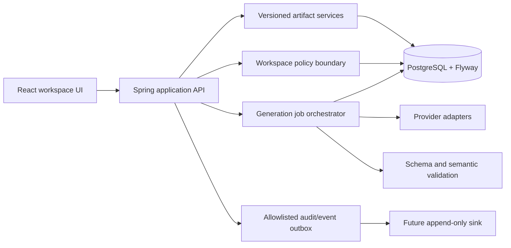

# Target architecture

## Direction

Retain the modular monolith as the system of record while making application
boundaries explicit enough to extract only when operational evidence demands
it. The target is not a microservice rewrite.

## Implemented now

- One Spring deployable, React SPA, PostgreSQL/Flyway, provider boundary, audit,
  owner isolation, and structured manual-test lifecycle.
- TF-001 personal workspaces, membership roles, membership-scoped listing, and
  project dual-write. Membership does not authorize shared content.

## Future bounded components

- `WorkspacePolicy` answers actor/action/resource decisions using active
  membership and role. Controllers supply identity; repositories remain scoped.
- `ArtifactVersionStore` captures immutable source and generated snapshots.
- `GenerationJob` persists state before provider invocation and supports safe
  retries, cancellation, idempotency, and terminal failure evidence.
- `AutomationDraftGenerator` emits a neutral intermediate representation; a
  Copado adapter serializes only reviewed drafts.
- An outbox forwards allowlisted domain/audit events without putting secrets or
  requirement bodies on the event bus.

## Deployment evolution

Scale the stateless API horizontally only after distributed rate limits and job
coordination exist. Keep database migrations under one release coordinator.
Provider workers may become a separate deployment when queue depth, latency, or
failure isolation justifies it; the domain and persistence contracts should not
assume that extraction in advance.
